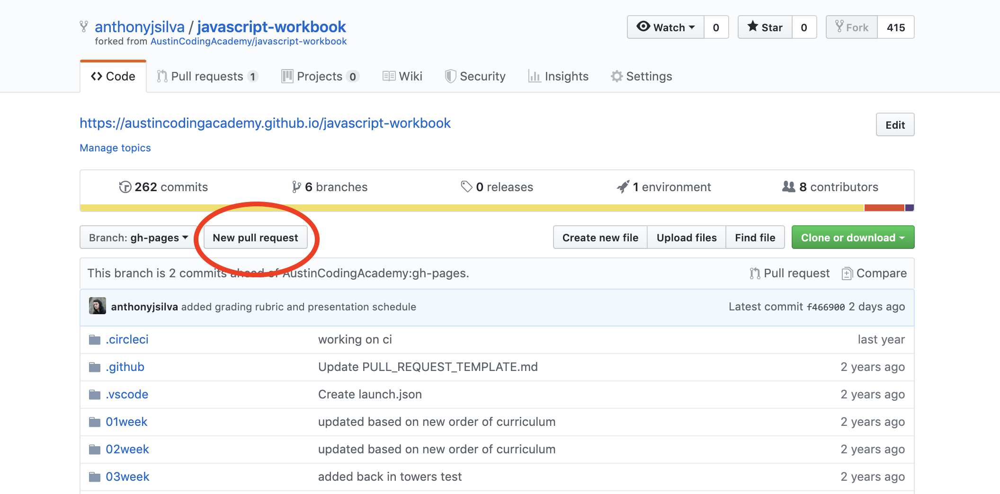
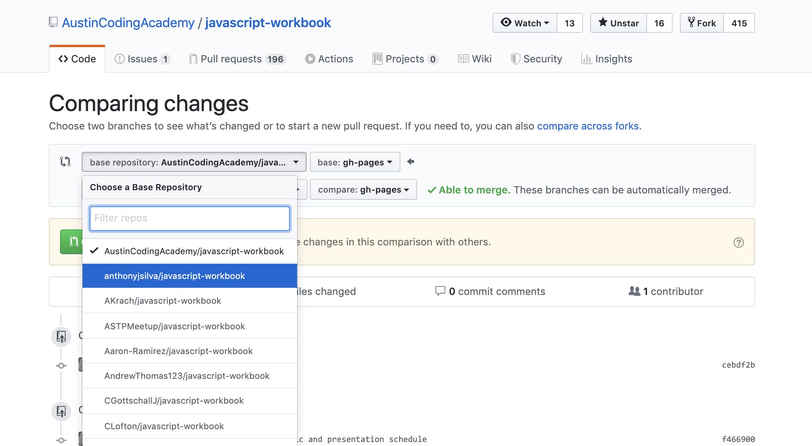
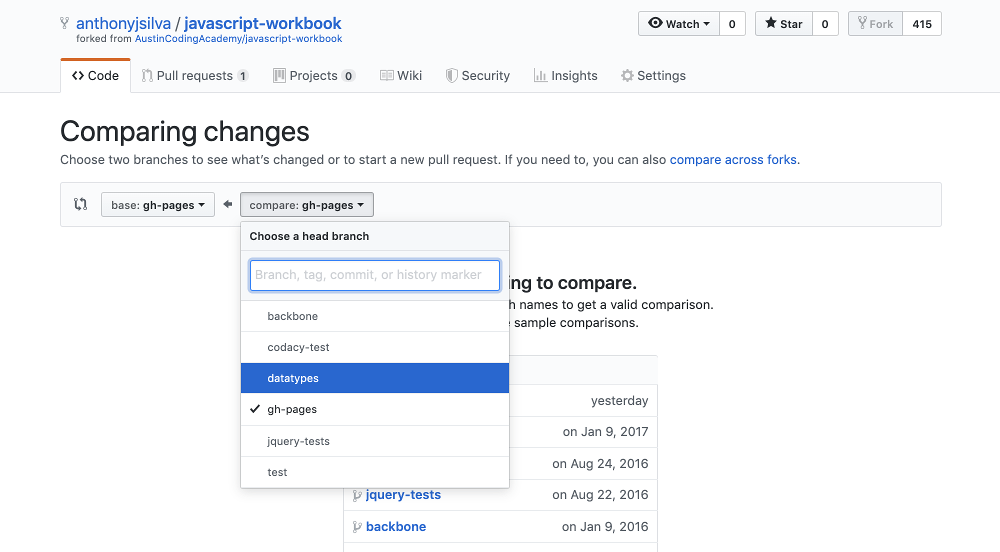
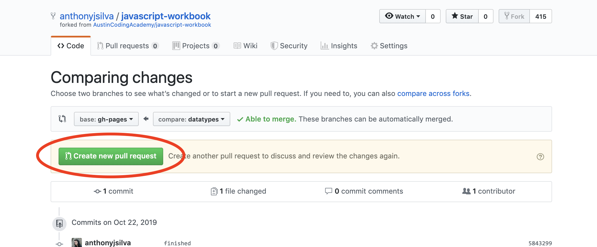
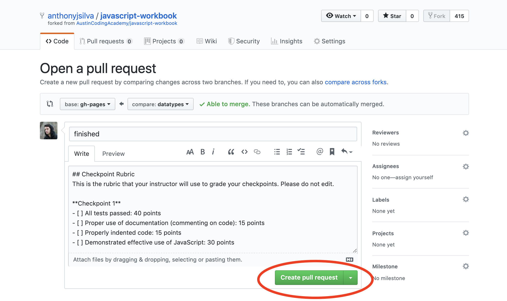
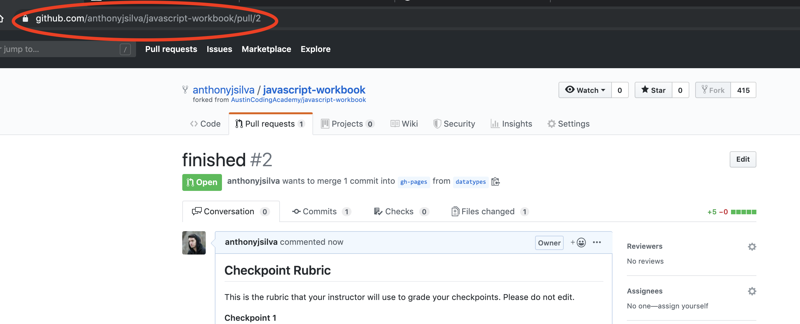
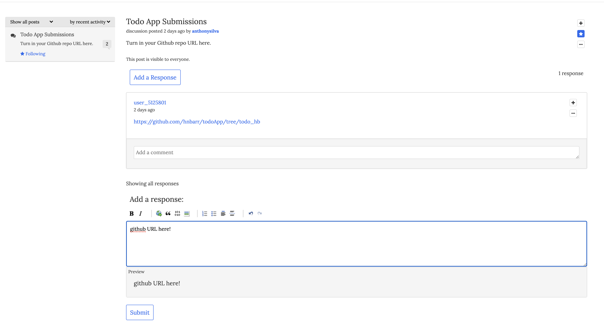

# Project Submission Guide

### When starting a new project try to follow this workflow

- create a new React app with create-react-app
  - `npx create-react-app your-project-name`
- `cd` into your new react project
- create a new branch off of master that you will do all your work on
  - `git checkout -b yourbranchname`
- install the project dependencies and start your local server
  - `npm i`
  - `npm start`
- as you make changes and get to good milestones / stopping points, make sure to
  - `git add .`
  - `git commit -m "your message"`
  - `git push origin yourbranchname`

### Once you are ready to turn in your project

- go to your repo on github
- click create pull request
  

<!-- - change the base repository from from `AustinCodingAcademy/the-name-of-project` to `yourname/the-name-of-project`
  

- change comparison branch to yourbranchname
  

- click "Create new pull request"
   -->

- click "Create pull request"
  

- copy the pull request URL
  
- paste that into the appropriate discussion post response section in Zollege
  
